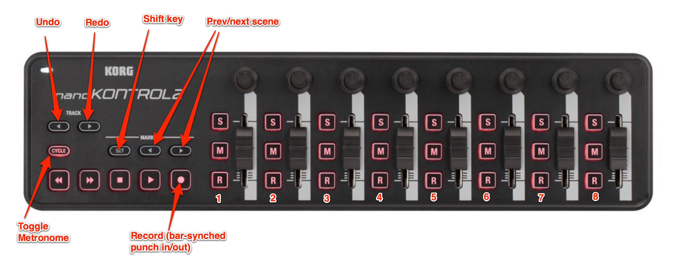
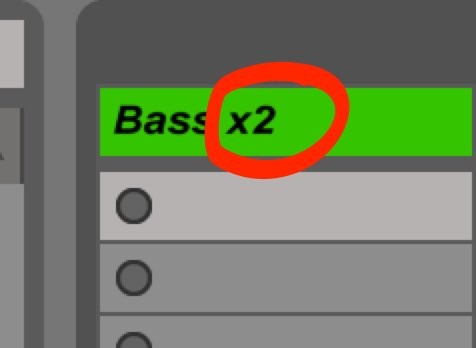
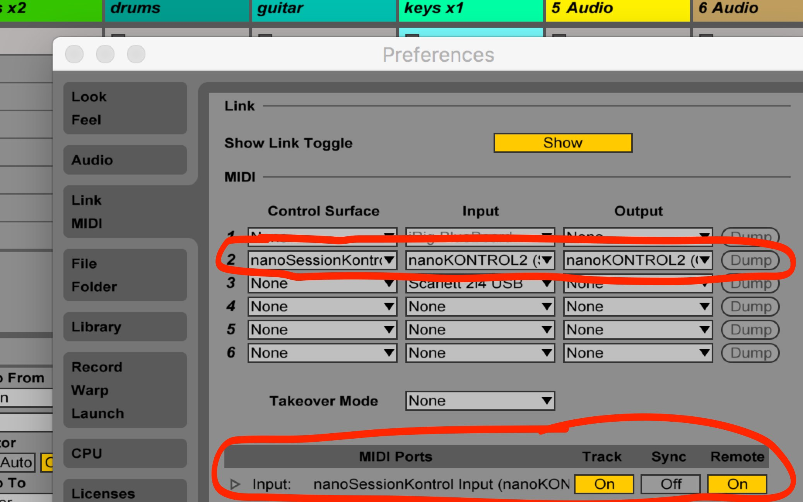

# nanoSessionKontrol
A Midi Remote script for controlling Ableton Live 9 using a Korg nanoKontrol2 mixer for live looping.

### Motivation
I use Ableton Live session and a Korg nanoKontrol2 mixer to record and loop various instruments (mainly bass, drums, guitar) in the Session view. I record each instrument individually and layer up the tracks like a live looper.

By default this mixer does not work great with Live because I found myself having to resort to the mouse for the following core tasks:

* Starting the metronone
* Selecting a bar length for the next track I want to record
* Recording a loop which punches in and out at the right point
* Hitting undo when I mess up a take
* Stopping the metronome once I have a beat going

If I have to reach for a mouse and look at a screen I find this breaks the flow. The script provided here extends Ableton Live to allow control of all the above operations using the nanoKontrol mixer.

### Using the controller
I normally have Live's Session view playing constantly with the metronome running so I can play in time.
##### Preparing to record
As is common, press an `R` button to select which track you will record into (unlike the photo, only one `R` is ever lit up at once to denote which track is armed for record).

Set the required bar length by pressing `Shift` and a choice of `R` button simultaneously. The first `R` button is for recording a 1 bar loop, the second `R` button for recording a 2 bar loop and so on. Pressing these buttons does not start recording it only sets how many bars will be recorded when the circular record button is pressed. The chosen number of bars is updated in the track label:

#### Recording
Pressing the circular record button will "punch in" on the beat so pressing it early gives you time to get your hands ready on the guitar/bass or whatever before recording actually starts. Also, the recording will automatically "punch out" or stop at the end of the chosen number of bars.

If you mess up a take (and I do this a lot) then just hit the `undo` button and try record again until you achieve perfection.

#### Other features
The previous-next scene keys will switch to the required scene at the end of the current bar.
Holding `Shift` and `M` mute buttons simultaneously will drop in or out the chosen tracks at the end of the current bar (without the Shift key these buttons normally take effect immediately)

## Installation
To install this MIDI Remote Script do the following

* Shut down Live
* Copy the "nanoSessionKontrol" folder to Ableton's Remote scripts directory e.g. using ` cp -R src/nanoSessionKontrol  "/Applications/Ableton Live 9 Intro.app/Contents/App-Resources/MIDI Remote Scripts"` 
* Restart Live
* In the Live->Preferences menu configure the control surface as follows:

 
### Implementation notes
This code is a tweaked version of existing scripts used for Mackie Control surfaces.  